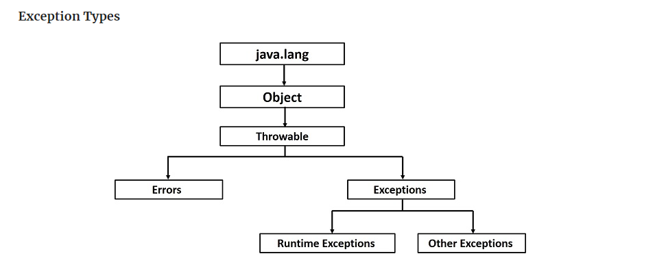

# **Read03**

## **Java Primitives versus Objects**


#### Java performs a conversion between the primitive and reference types if an actual type is different from the declared one:

```(
Integer j = 1;          // autoboxing(reference)
int i = new Integer(1); // unboxing(primitive)
```

<br>

+ ### **Single Item Memory Footprint**
####  the primitive type variables have the following impact on the memory:
+ boolean – 1 bit
+ byte – 8 bits
+ short, char – 16 bits
+ int, float – 32 bits
+ long, double – 64 bits

####  the reference type variables have the following impact on the memory:
+ Boolean – 128 bits
+ Byte – 128 bits
+ Short, Character – 128 bits
+ Integer, Float – 128 bits
+ Long, Double – 192 bits

<br>

+ ### **Performance**
#### the primitive types live in the stack while the reference types live in the heap. This is a dominant factor that determines how fast the objects get be accessed.


# **Exceptions**

## What Is an Exception? 
#### An exception is an unwanted or unexpected event, which occurs during the execution of a program i.e at run time.



<br>

## The Catch or Specify Requirement

<br>

### Valid Java programming language code must honor the Catch or Specify Requirement. 
+ ### The **try** statement allows you to define a block of code to be tested for errors while it is being executed.

+ ### The **catch** statement allows you to define a block of code to be executed, if an error occurs in the try block.

```
try 
{
    //  Block of code to try
}
catch(Exception e) 
{ 
    //  Block of code to handle errors
}
```

<br>

### **There are Three Kinds of Exceptions:**
+ #### The first kind of exception is the checked exception.
+ #### The second kind of exception is the error.
+ #### The third kind of exception is the runtime exception.


## **How to Throw Exceptions**
### Throwing an exception is as simple as using the "throw" statement. You then specify the Exception object you wish to throw. Every Exception includes a message which is a human-readable error description.

<br>

```
throw Instance
Example:
throw new ArithmeticException("/ by zero");
```

