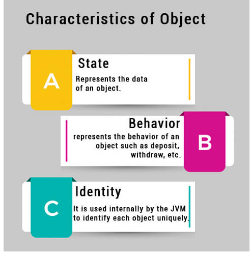
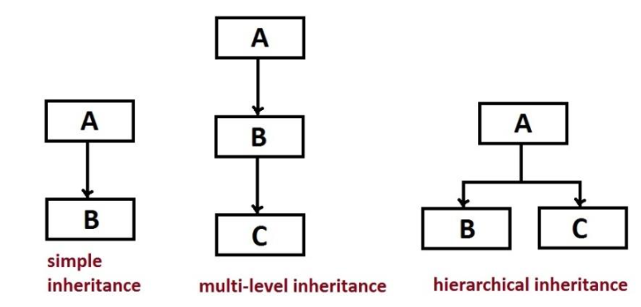
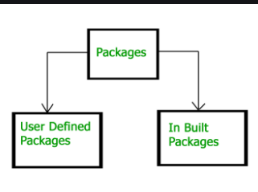
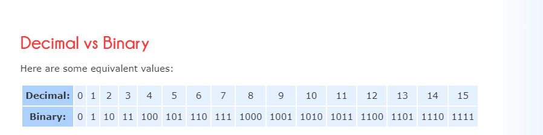
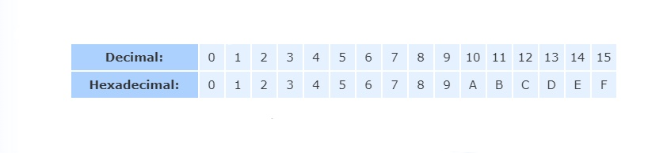

<br>

# **Read04**
<br>

# **What is an object in Java ?**
### An entity that has state and behavior is known as an object e.g., chair, bike, marker, pen, table, car, etc. It can be physical or logical (tangible and intangible). The example of an intangible object is the banking system.

### An object has three characteristics:



#### **An object is an instance of a class. A class is a template or blueprint from which objects are created. So, an object is the instance(result) of a class.**

<br>

# **What is a class ?**
### A class is a group of objects which have common properties. It is a template or blueprint from which objects are created. It is a logical entity. It can't be physical.

#### A class in Java can contain:

+ **Fields**
+ **Methods**
+ **Constructors**
+ **Blocks**
+ **Nested class and interface**

```
class <class_name>{  
    field;  
    method;  
}  
```

<br>

# **What Is Inheritance?**
### Inheritance is a mechanism in which one object acquires all the properties and behaviors of a parent object. The idea behind inheritance in Java is that you can create new classes that are built upon existing classes.
```
class Subclass-name extends Superclass-name  
{  
   //methods and fields  
}  
```

+ ### **TYPES OF INHERITANCE:**



<br>

# **What Is an Interface ?**

### Methods form the object's interface with the outside world; the buttons on the front of your television set, for example, are the interface between you and the electrical wiring on the other side of its plastic casing. You press the "power" button to turn the television on and off.

### **So:**
+ #### An Interface in Java programming language is defined as an abstract type used to specify the behavior of a class.
+ #### An interface in Java is a blueprint of a class.
+ #### A Java interface contains static constants and abstract methods.


<br>

# **What Is a Package ?**
### A Java package organizes Java classes into namespaces, providing a unique namespace for each type it contains. Classes in the same package can access each other's package-private and protected members.

## **Types of packages:**


<br>
<br>

# **Binary, Decimal and Hexadecimal Numbers**

+ ## A Binary Number is made up of only 0s and 1s.
+ ## A Decimal Number (based on the number 10) contains a Decimal Point.

## **Decimal vs Binary**


+ ## A Hexadecimal Number is based on the number 16.

## ***Decimal vs Hexadecimal**

