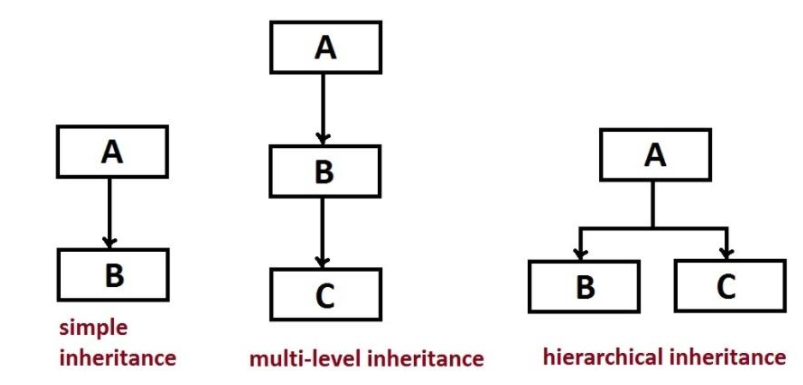

# **Inheritance**
### Inheritance is a mechanism in which one object acquires all the properties and behaviors of a parent object. The idea behind inheritance in Java is that you can create new classes that are built upon existing classes.
```
class Subclass-name extends Superclass-name  
{  
   //methods and fields  
}  
```

+ ### **TYPES OF INHERITANCE:**


<br>

## **Example:**
```
 Employee{  
 float salary=40000;  
}  
class Programmer extends Employee{  
 int bonus=10000;  
 public static void main(String args[]){  
   Programmer p=new Programmer();  
   System.out.println("Programmer salary is:"+p.salary);  
   System.out.println("Bonus of Programmer is:"+p.bonus);  
}  
}  
```


<br>

# **Interface**

### Methods form the object's interface with the outside world; the buttons on the front of your television set, for example, are the interface between you and the electrical wiring on the other side of its plastic casing. You press the "power" button to turn the television on and off.

### **So:**
+ #### An Interface in Java programming language is defined as an abstract type used to specify the behavior of a class.
+ #### An interface in Java is a blueprint of a class.
+ #### A Java interface contains static constants and abstract methods.


<br>

```
interface <interface_name>{  
      
    // declare constant fields  
    // declare methods that abstract   
    // by default.  
}  
```


### The relationship between classes and interfaces:


<br>

### **Why use Java interface?**
+ ####**It is used to achieve abstraction.**
+ ####**By interface, we can support the functionality of multiple inheritance.**
+ ####**It can be used to achieve loose coupling.**