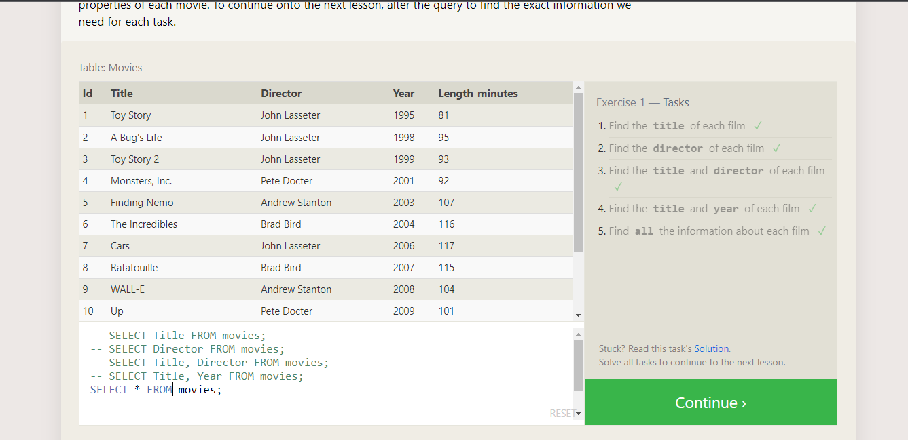
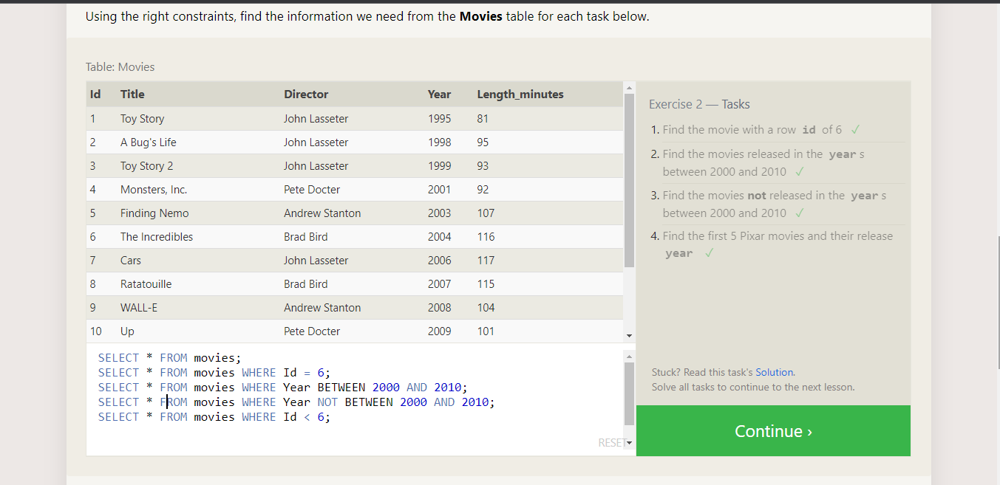
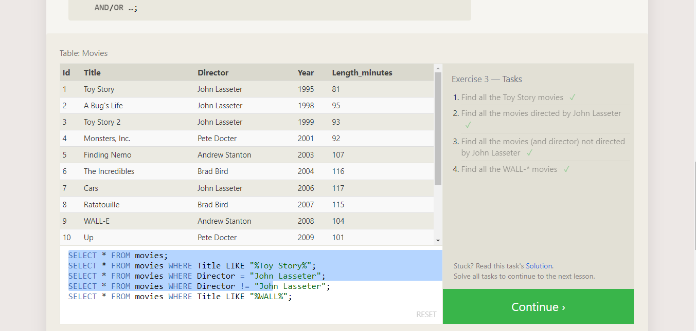
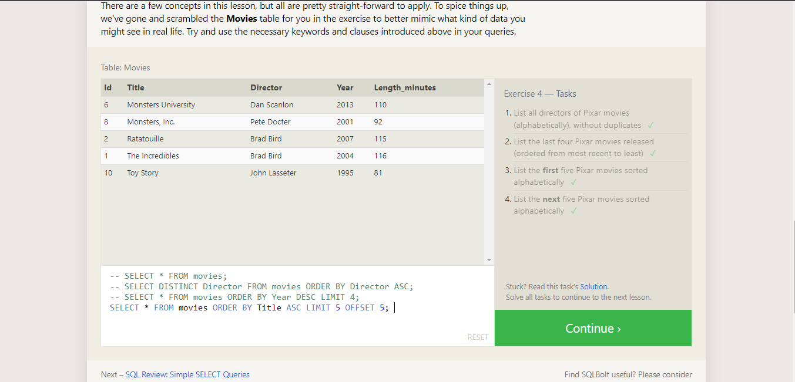
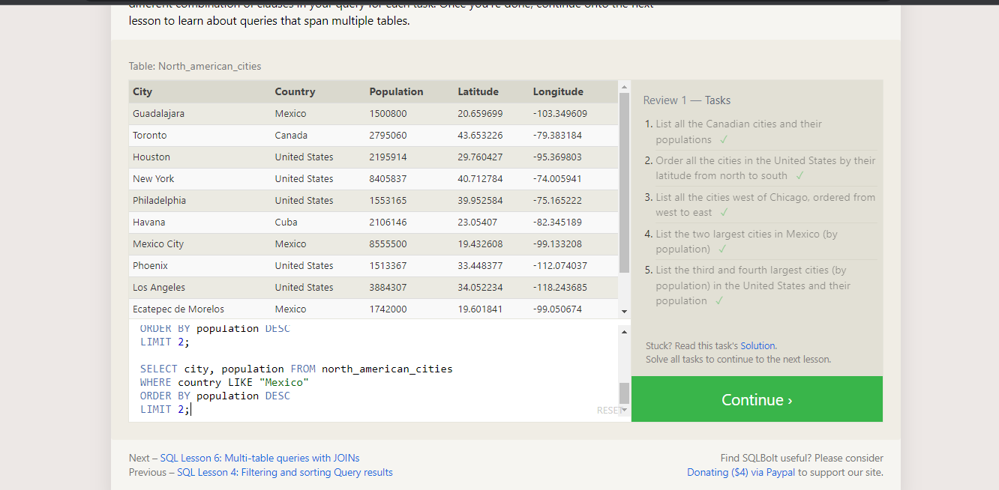

# **SOL**

#### SQL is a standard language for accessing and manipulating databases.
#### What Can SQL do?
#### SQL can execute queries against a database
#### SQL can retrieve data from a database
#### SQL can insert records in a database
#### SQL can update records in a database
#### SQL can delete records from a database
#### SQL can create new databases
#### SQL can create new tables in a database
#### SQL can create stored procedures in a database
#### SQL can create views in a database
#### SQL can set permissions on tables, procedures, and views
 
  
  
 
## SELECT queries 101

## SQL Lesson 2: Queries with constraints:

## SQL Lesson 3: Queries with constraints:

## SQL Lesson 4: Filtering and sorting Query results

## Simple SELECT Queries

